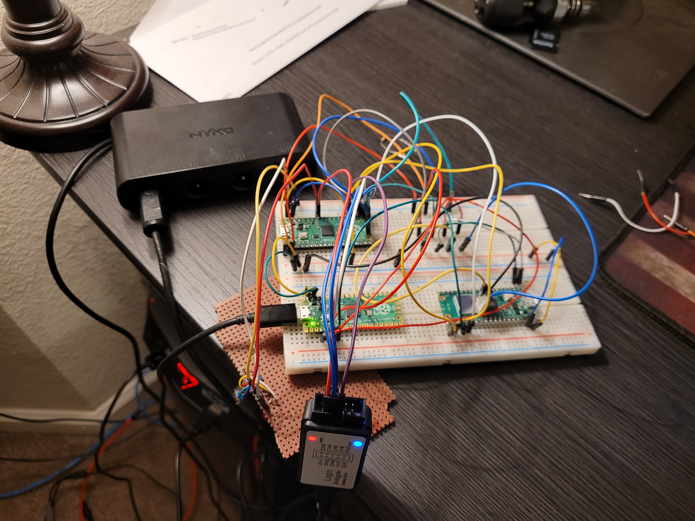

# Bluetooth GameCube Controller Adapter

Note: Even though this photo shows a USB adapter, this has been tested with real hardware. I found a USB adapter to be really useful for debugging, and it potentially saved me from frying my GameCube a few times, too!

I plan on doing a more official write-up of this project in the future! But here is some basic information:

This was a personal project that I set out on for fun. It also ended up being way more of a challenge than I expected.
The idea is simple: I wanted a way to connect my Nintendo Switch controller to my GameCube.
I had just modified my GameCube with [PicoBoot](https://github.com/webhdx/PicoBoot), which gave me the idea of using Raspberry Pi Picos.
In the end, I had to use two Picos (a W and a non-W) to accomplish this. Both are powered using 5 V from the GameCube's controller port. One Pico handles Bluetooth communication with the Switch Controller, and the other handles communication with the GameCube. The Bluetooth Pico sends data to the GameCube Pico over SPI.

The Bluetooth Pico is running C code, but the GameCube Pico is programmed using assembly. There may have been a way to implement the GameCube protocol with just C, but I found that the compiler wasn't producing code that was fast enough to keep up with the GameCube. I also thought it was a fun challenge, because I'd never written such a large program in assembly before.

I wanted to do this project with only one Pico, but I had a lot of trouble implementing Blueooth on top of the GameCube communication. While the Pico does have two cores, interrupts were a headache to deal with, considering the tight timing of the GameCube protocol. In the end, it might still be possible, but I couldn't easily figure it out.

## Future Plans

* Currently, my Bluetooth implementation is hard-coded to connect to my Switch controller. It also panics when the controller disconnects.

* All of the code is sloppy and undocumented. It will be tweaked and cleaned up for other people to use.

* The connection between the Picos seems to be somewhat unstable. Sometimes packets are dropped or the bytes are sent in the wrong order.

* PCB and 3D printed case!

## Resources

### Raspberry Pi Pico

[Getting Started with Raspberry Pi Pico C/C++ Development](https://datasheets.raspberrypi.com/pico/getting-started-with-pico.pdf)

[Raspberry Pi Pico C SDK](https://datasheets.raspberrypi.com/pico/raspberry-pi-pico-c-sdk.pdf)

[Raspberry Pi Pico C Examples](https://github.com/raspberrypi/pico-examples)

[Pico C SDK Online Documentation](https://www.raspberrypi.com/documentation/pico-sdk/)

[RP2040 Datasheet](https://datasheets.raspberrypi.com/rp2040/rp2040-datasheet.pdf)

[Cortex-M0 User Guide](https://developer.arm.com/documentation/dui0497/a/the-cortex-m0-instruction-set?lang=en)

### GameCube Controller Protocol

Kyle McDowell's [GameCube controller protocol documentation.](https://simplecontrollers.com/blogs/resources/gamecube-protocol)

Another [GameCube controller protocol documentation](http://www.int03.co.uk/crema/hardware/gamecube/gc-control.html) (unfortunately I cannot find the author).

### Bluetooth

[BTstack](https://github.com/bluekitchen/btstack)

Brian Starkey's [DualShock 4 on Pico W](https://github.com/usedbytes/picow_ds4)

## Credits

Thanks to Stephen Smith for [his invaluable book on writing assembly for the RP2040.](https://www.eetree.cn/wiki/_media/rp2040_assembly_language_programming_arm_cortex-m0_on_the_raspberry_pi_pico_etc._z-lib.org_-2.pdf)

Thanks to Tony Smith for his [guides on writing RP2040 assembly and example projects.](https://blog.smittytone.net/2022/06/19/get-started-with-arm-assembly-on-the-pi-pico/)

Thanks to NicoHood for [inspiration.](https://github.com/NicoHood/Nintendo)
